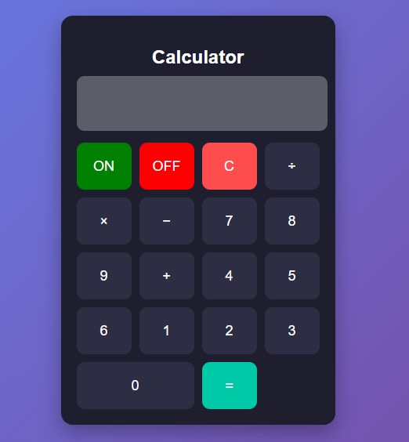
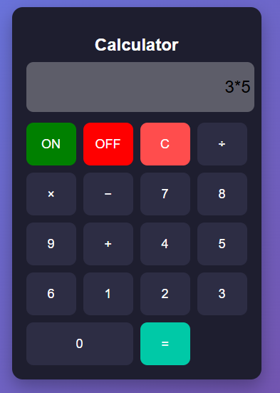
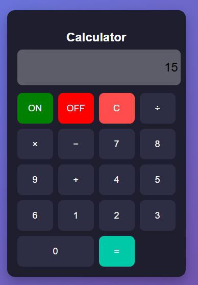

# 🧮 JavaScript Calculator

A responsive calculator built using **HTML, CSS, and JavaScript(ES6)**.  
This project demonstrates basic arithmetic operations along with interactive UI and ON/OFF functionality.

## 📸 Preview


## 🔗 Live Demo
[🎮 Play Live Game](https://kg-se.github.io/calculator/)

---

## 🚀 Features

- ➕ Addition, ➖ Subtraction, ✖️ Multiplication, ➗ Division  
- 🔘 ON/OFF functionality (real calculator behavior)  
- 🎨 Modern UI design  
- 📱 Responsive layout  
- ⚡ Fast and interactive user experience  

---

## 🛠️ Technologies Used

- HTML  
- CSS  
- JavaScript (ES6) 

## 📸 Screenshots

### Working UI


### Result UI


---

## 💡 What I Learned

- DOM Manipulation  
- Eval Function
- Building interactive web applications  
- Improving UI design with CSS  

---

## 📂 Project Structure
```bash
index.html
style.css
script.js
screenshots/
```

---

This project helped me to improved my HTML, CSS & JavaScript (ES6) concepts and frontend development skills

---

## 👨‍💻 Author
**Kashan Ghori**  
🔗 https://github.com/KG-SE

## 🤝 Connect with Me

Feel free to connect with me on LinkedIn and check out my projects!

---

⭐ If you like this project, don't forget to star the repository!
